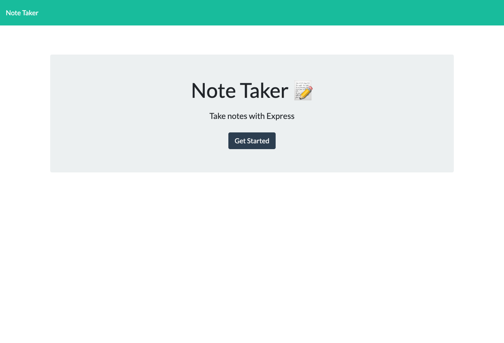
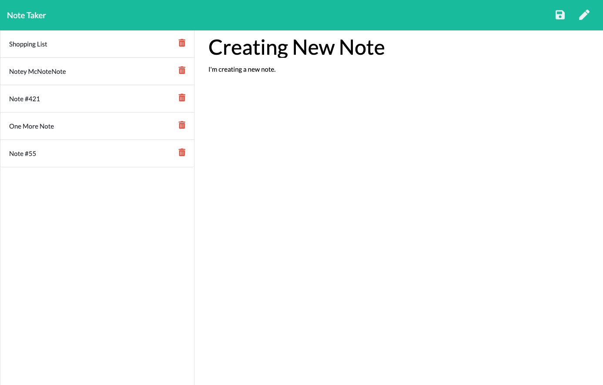
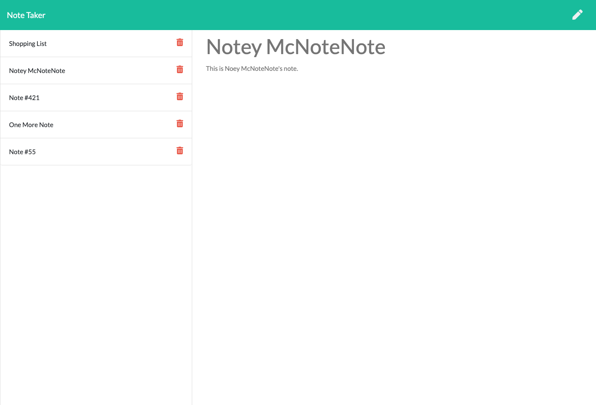

# note-taker

---

## Description

note-taker is an application that allows a user to create and save notes similar to the way notes can be saved on an iPhone or iPad.  

---


note-taker Splash Screen

---


note-taker Note Creation

---


note-taker Note Display

--- 

## Link to Deployed Application

https://stormy-island-91602.herokuapp.com/ 

---

## GitHub Repository

https://github.com/swillrich5/note-taker

---

## Table of Contents

* [Installation](#installation)

* [Usage](#usage)

* [Technology](#technology)

* [License](#license)

* [Contributing](#Contributing)

* [Questions](#Questions)

---

## Installation

Install the required node modules by running:

```
npm i
```
---

## Usage

After install the required npm modules, the application can be started and run locally by entering:

```
node server.js
```
from the command line.  The web page can be accessed from the browser at:
```
http://localhost:3000
```

The user clicks on the "Get Started" button to go to the Notes screen. From there a user can Add, View, or Delete a note.

* To add a note, a user clicks the pencil icon, and then enters a note title and the text of the note.  The note can then be saved by clicking the save icon.

* To View a note, the user simply clicks on the title of the note.

* To Delete a note, the user clicks on the trash can icon next to the title of the note.

---

## Technology

The following technology was used to build note-taker:

  * node - https://nodejs.org/en/

  * express - https://expressjs.com/

  * uuid - https://www.npmjs.com/package/uuid 

  * Bootstrap v4.1.3 - https://getbootstrap.com/docs/4.1/getting-started/introduction/

  * Font Awesome v.5.3.1 - https://fontawesome.com/

---

## License

None

---

## Contributing

Please report any issues using my contact information below.

---

## Questions

GitHub Profile: https://github.com/swillrich5

Email Address: swillrich@gmail.com